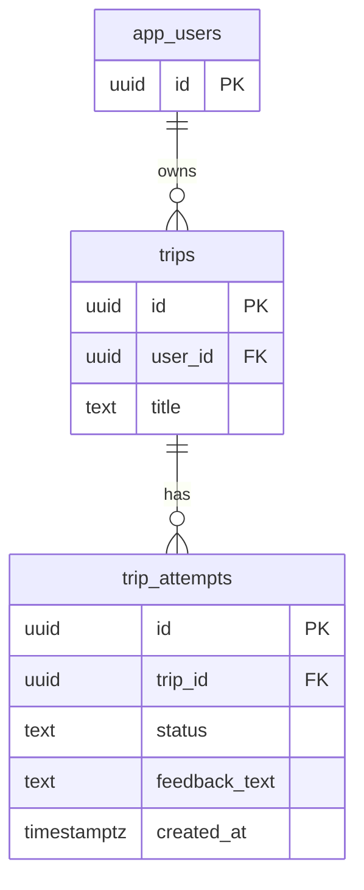

# DB 스키마

변경일: 2026-06-27  
변경 브랜치: `feat/14-trip`

이 문서는 현재 코드베이스의 DB 스키마를 기준으로 작성한다. 초기화 SQL은 `backend/db/init/001_trips.sql`에 있다.

## ER 다이어그램



## 테이블

### app_users

사용자 식별자를 저장한다.

| 컬럼 | 타입 | 제약 |
| --- | --- | --- |
| `id` | `uuid` | primary key, default `gen_random_uuid()` |

### trips

사용자가 생성한 여행을 저장한다.

| 컬럼 | 타입 | 제약 |
| --- | --- | --- |
| `id` | `uuid` | primary key, default `gen_random_uuid()` |
| `user_id` | `uuid` | not null, references `app_users(id)` |
| `title` | `text` | not null |

### trip_attempts

여행에 대한 개별 시도를 저장한다.

| 컬럼 | 타입 | 제약 |
| --- | --- | --- |
| `id` | `uuid` | primary key, default `gen_random_uuid()` |
| `trip_id` | `uuid` | not null, references `trips(id)` |
| `status` | `text` | not null |
| `feedback_text` | `text` | nullable |
| `created_at` | `timestamptz` | not null, default `now()` |

`status`는 DB에서는 `text`로 저장한다. API 계층에서는 `started`, `completed`, `aborted`만 허용한다.

## 초기 데이터

개발/검증용 고정 사용자를 생성한다.

```text
00000000-0000-0000-0000-000000000000
```

초기 trip과 attempt도 함께 생성한다.

```text
trip id: 10000000-0000-0000-0000-000000000001
attempt id: 20000000-0000-0000-0000-000000000001
```
