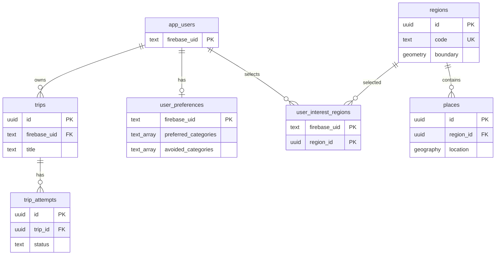

# Database schema

Alembic is the only schema authority. `20260810_01` records the legacy UUID
baseline; `20260810_02` performs the Firebase UID and PostGIS cutover. Docker
entrypoint initialization SQL is not used.



All primary domain tables have `created_at` and `updated_at` timestamps, except the
join table, which needs only `created_at`. Attempt status is constrained to
`started`, `completed`, or `aborted`.

`regions.boundary` is `geometry(MultiPolygon,4326)` and `places.location` is
`geography(Point,4326)`. The API derives latitude and longitude from `location`;
there are no duplicate coordinate columns. GiST indexes cover both spatial columns.
The `(trip_id, created_at DESC, id DESC)` index preserves deterministic latest-attempt
selection.

`app_users` contains only the Firebase UID projection required for relational
integrity. Preference category lists are native `text[]`. Managed interest regions
are atomically replaced through the repository; a public API is intentionally not
part of this change.

Seed data is separate from migrations:

```sh
cd backend
uv run python -m app.commands.seed
```
