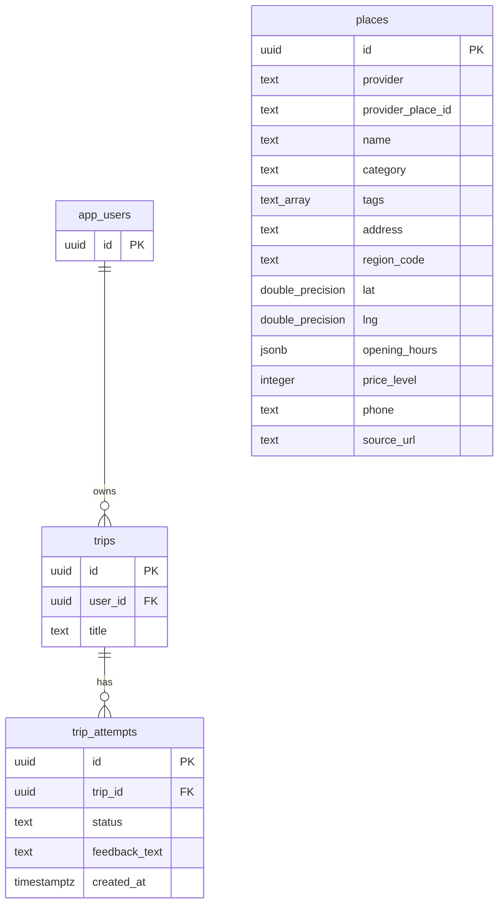

# DB 스키마

변경일: 2026-07-12

변경 브랜치: `feat/21-placeDB-migration`

이 문서는 현재 코드베이스의 DB 스키마를 기준으로 작성한다. 초기화 SQL은
`backend/db/init/001_trips.sql`과 `backend/db/init/002_places.sql`에 있다.

## ER 다이어그램



## 테이블

### app_users

사용자 식별자를 저장한다.

| 컬럼 | 타입 | 제약 |
| --- | --- | --- |
| `id` | `uuid` | primary key, default `gen_random_uuid()` |

### trips

사용자가 생성한 여행을 저장한다.

| 컬럼 | 타입 | 제약 |
| --- | --- | --- |
| `id` | `uuid` | primary key, default `gen_random_uuid()` |
| `user_id` | `uuid` | not null, references `app_users(id)` |
| `title` | `text` | not null |

### trip_attempts

여행에 대한 개별 시도를 저장한다.

| 컬럼 | 타입 | 제약 |
| --- | --- | --- |
| `id` | `uuid` | primary key, default `gen_random_uuid()` |
| `trip_id` | `uuid` | not null, references `trips(id)` |
| `status` | `text` | not null |
| `feedback_text` | `text` | nullable |
| `created_at` | `timestamptz` | not null, default `now()` |

`status`는 DB에서는 `text`로 저장한다. API 계층에서는 `started`, `completed`, `aborted`만 허용한다.

### places

장소 검색과 상세 조회에 사용하는 장소 정보를 저장한다. 현재 다른 테이블과의
외래 키 관계는 없다.

| 컬럼 | 타입 | 제약 |
| --- | --- | --- |
| `id` | `uuid` | primary key, default `gen_random_uuid()` |
| `provider` | `text` | not null |
| `provider_place_id` | `text` | not null |
| `name` | `text` | not null |
| `category` | `text` | not null |
| `tags` | `text[]` | not null, default `{}` |
| `address` | `text` | not null |
| `region_code` | `text` | not null |
| `lat` | `double precision` | not null, `-90` 이상 `90` 이하 |
| `lng` | `double precision` | not null, `-180` 이상 `180` 이하 |
| `opening_hours` | `jsonb` | not null, default `{}` |
| `price_level` | `integer` | not null, `0` 이상 |
| `phone` | `text` | nullable |
| `source_url` | `text` | not null |

`provider`와 `provider_place_id`의 조합은 유일해야 한다.

## 초기 데이터

개발/검증용 고정 사용자를 생성한다.

```text
00000000-0000-0000-0000-000000000000
```

초기 trip과 attempt도 함께 생성한다.

```text
trip id: 10000000-0000-0000-0000-000000000001
attempt id: 20000000-0000-0000-0000-000000000001
```

장소 검색과 상세 조회 검증을 위한 부천시 장소 3건도 생성한다.

| ID | 장소명 | 카테고리 |
| --- | --- | --- |
| `30000000-0000-0000-0000-000000000001` | 한국만화박물관 | `museum` |
| `30000000-0000-0000-0000-000000000002` | 상동호수공원 | `park` |
| `30000000-0000-0000-0000-000000000003` | 부천아트센터 | `concert_hall` |
